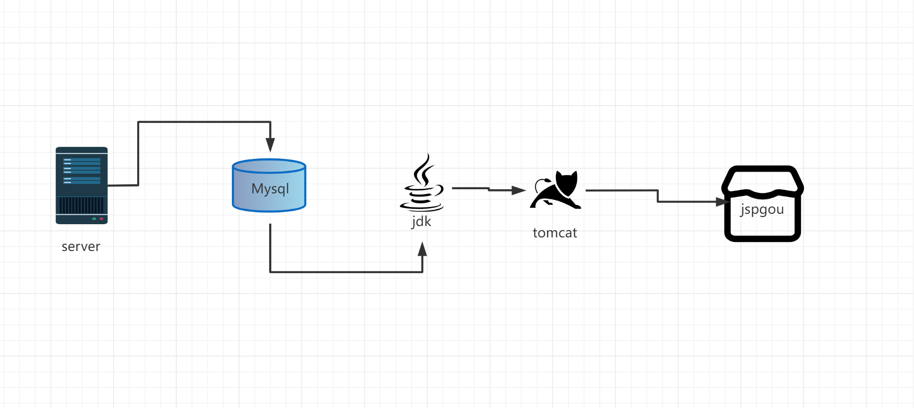
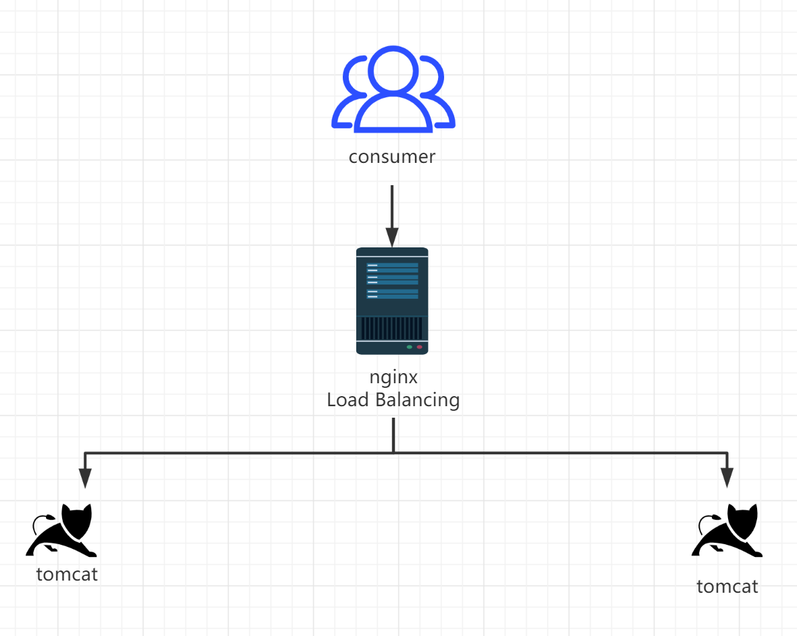
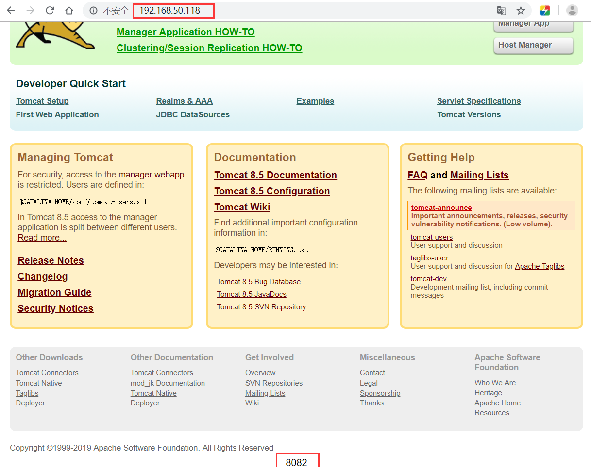
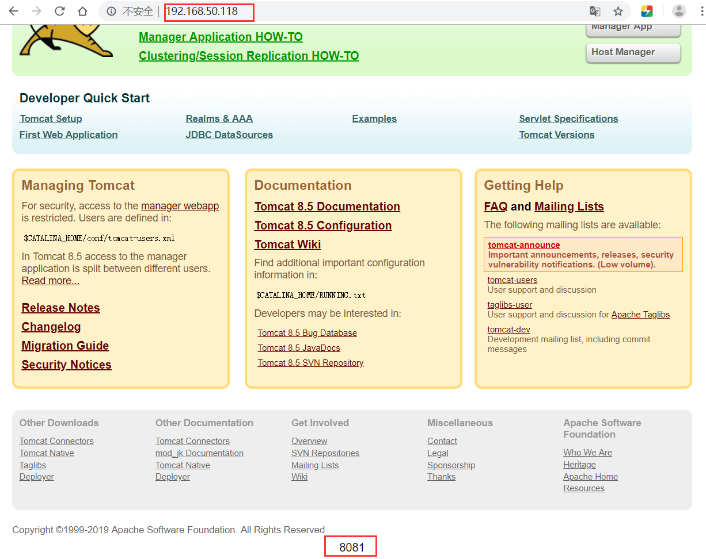
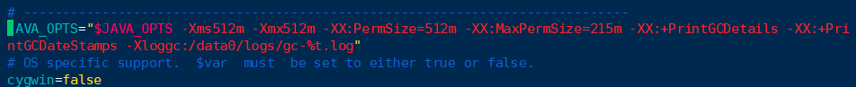
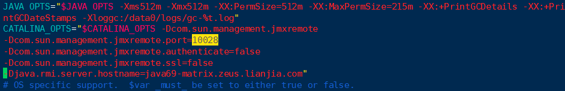
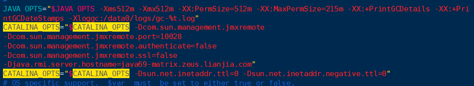

# 企业TomCat运维



## 1、系统环境说明

```shell
[root@java-tomcat1 ~]# cat /etc/redhat-release 
##查看系统版本, 红帽发行信息

[root@java-tomcat1 ~]# uname -a 
##显示系统名、节点名称、操作系统的发行版号、内核版本等等

[root@java-tomcat1 ~]# getenforce 
##查看系统当前 SELinux 的工作模式

[root@java-tomcat1 ~]# systemctl status firewalld
##查看防火墙的状态
```


## 2、安装jdk

```shell
[root@java-tomcat1 ~]# tar xzf jdk-8u191-linux-x64.tar.gz -C /usr/local/

[root@java-tomcat1 ~]# cd /usr/local/

[root@java-tomcat1 local]# mv jdk1.8.0_191/ java

[root@java-tomcat1 local]# vim /etc/profile

##设置环境变量

#############################################

JAVA_HOME=/usr/local/java
PATH=$JAVA_HOME/bin:$PATH

#############################################
```


```shell
export JAVA_HOME=/usr/local/java   #指定java安装目录
export PATH=$JAVA_HOME/bin:$JAVA_HOME/jre/bin:$PATH    #用于指定java系统查找命令的路径
export CLASSPATH=.:$JAVA_HOME/lib:$JAVA_HOME/jre/lib:$JAVA_HOME/lib/tools.jar  #类的路径，在编译运行java程序时，如果有调用到其他类的时候，在classpath中寻找需要的类。


```

```shell
[root@java-tomcat1 local]# source /etc/profile

##应用环境变量

[root@java-tomcat1 local]# java -version

##检测jdk是否安装成功
```


## 3、安装tomcat

```shell
[root@java-tomcat1 ~]# mkdir /data/application -p
[root@java-tomcat1 ~]# cd /usr/src/
[root@java-tomcat1 ~]# yum -y install wget

[root@java-tomcat1 src]# wget http://mirrors.tuna.tsinghua.edu.cn/apache/tomcat/tomcat-8/v8.5.46/bin/apache-tomcat-8.5.46.tar.gz
[root@java-tomcat1 src]# tar xzf /root/apache-tomcat-8.5.46.tar.gz -C /data/application/
[root@java-tomcat1 src]# cd /data/application/
[root@java-tomcat1 application]# mv apache-tomcat-8.5.46/ tomcat

[root@java-tomcat1 application]# vim /etc/profile
```


```shell
export TOMCAT_HOME=/data/application/tomcat   #指定tomcat的安装目录
##设置环境变量
```

```shell
[root@java-tomcat1 application]# source  /etc/profile

##应用环境变量

[root@java-tomcat1 tomcat]# /data/application/tomcat/bin/version.sh

##查看tomcat是否安装成功

/data/application/tomcat/bin/startup.sh

##启动tomcat程序

[root@java-tomcat1 bin]# netstat -lntp  |grep java

##查看端口号

##打开游览器输入ip查看tomcat是否启动

/data/application/tomcat/bin/shutdown.sh

##关闭tomcat程序
```


## 4、web站点部署

```shell
[root@java-tomcat1 ~]# wget http://updates.jenkins-ci.org/download/war/2.129/jenkins.war
[root@java-tomcat1 ~]# ls
jenkins.war

##下载jenkins的war包

[root@java-tomcat1 ~]# cd /data/application/tomcat   

##进入tomcat目录
[root@java-tomcat1 tomcat]# cp -r webapps/ /opt/    

##将原来的发布网站目录备份

[root@java-tomcat1 tomcat]# cd webapps/
[root@java-tomcat1 webapps]# ls
docs  examples  host-manager  manager  ROOT

[root@java-tomcat1 webapps]# rm -rf *    

##清空发布网站里面的内容
[root@java-tomcat1 webapps]# cp /root/jenkins.war .  

##将war包拷贝到当前目录
[root@java-tomcat1 webapps]# ../bin/startup.sh   

##启动

[root@java-tomcat1 ~]# mkdir /data/application/webapp  

##创建发布目录
[root@java-tomcat1 ~]# vim /data/application/tomcat/conf/server.xml

##将原来的webapps改为webapp

[root@java-tomcat1 ~]# cp /root/jenkins.war /data/application/webapp/
[root@java-tomcat1 ~]# /data/application/tomcat/bin/startup.sh


```


## 5、部署开源站点（jspgou商城）

```shell
[root@yangge ~]# yum -y install mariadb mariadb-server
[root@yangge ~]# systemctl start mariadb
[root@yangge ~]# mysql
create database jspgou default charset=utf8;	

##在数据库中操作，创建数据库并指定字符集
flush privileges;
exit;

##上传jspgou商城的代码
[root@java-tomcat1 ~]# unzip jspgouV6.1-ROOT.zip
[root@java-tomcat1 ~]# cp -r ROOT/ /data/application/tomcat/webapp/
[root@java-tomcat1 ~]# cd /data/application/tomcat/webapp/
[root@java-tomcat1 webapps]# ls
ROOT

##将数据导入数据库:
[root@java-tomcat1 ~]# cd DB/
[root@java-tomcat1 DB]# ls
jspgou.sql
[root@java-tomcat1 DB]# mysql -uroot -p  jspgou < jspgou.sql
source  jspgou.sql

##启动tomcat访问:
[root@java-tomcat1 ~]# /data/application/tomcat/bin/startup.sh
[root@java-tomcat1 ~]# netstat -lntp
```


# TomCat多实例配置

## 1、复制程序文件

```shell
[root@java-tomcat1 ~]# cd /data/application/
[root@java-tomcat1 application]# ls
tomcat
[root@java-tomcat1 application]# cp -r tomcat/ tomcat_2
[root@java-tomcat1 application]# ls
tomcat  tomcat_2
[root@java-tomcat1 application]# sed -i 's@8005@8011@;s/8080/8081/' tomcat/conf/server.xml
[root@java-tomcat1 application]# sed -i 's#8005#8012#;s#8080#8082#' tomcat_2/conf/server.xml
[root@java-tomcat1 application]# sed -i 's#8009#8019#' tomcat/conf/server.xml
[root@java-tomcat1 application]# sed -i 's#8009#8029#' tomcat_2/conf/server.xml

##修改端口，以启动多实例。多实例之间端口不能一致

[root@java-tomcat1 application]# diff tomcat/conf/server.xml tomcat_2/conf/server.xml  #对比文件不同之处
```


## 2、检查端口查看是否启动

```shell
[root@java-tomcat1 application]# netstat -lntp | grep java 

##在浏览器访问并进行测试
```


# TomCat反向代理集群



## 1、负载均衡器说明

```shell
关闭防火墙和selinux

yum安装nginx
[root@nginx-proxy ~]# cd /etc/yum.repos.d/
[root@nginx-proxy yum.repos.d]# vim nginx.repo
[nginx-stable]
name=nginx stable repo
baseurl=http://nginx.org/packages/centos/$releasever/$basearch/
gpgcheck=0
enabled=1
[root@nginx-proxy yum.repos.d]# yum install yum-utils -y
[root@nginx-proxy yum.repos.d]# yum install nginx -y
```


## 2、配置负载均衡器

```shell
备份原配置文件并修改

[root@nginx-proxy ~]# cd /etc/nginx/conf.d/
[root@nginx-proxy conf.d]# cp default.conf default.conf.bak
[root@nginx-proxy conf.d]# mv default.conf tomcat.conf
[root@nginx-proxy conf.d]# vim tomcat.conf
upstream testweb {
	server 192.168.50.114:8081 weight=1 max_fails=1 fail_timeout=2s;
	server 192.168.50.114:8082 weight=1 max_fails=1 fail_timeout=2s;
}
server {
    listen       80;
    server_name  localhost;
    access_log  /var/log/nginx/proxy.access.log  main;

location / {
   root /usr/share/nginx/html;
   index index.html index.htm;
   proxy_pass http://testweb;
   proxy_set_header Host $host:$server_port;
   proxy_set_header X-Real-IP $remote_addr;
   proxy_set_header X-Forwarded-For $proxy_add_x_forwarded_for;
    }       
error_page   500 502 503 504  /50x.html;
location = /50x.html {
    root   /usr/share/nginx/html;
} 


}
创建upstream配置文件:
[root@nginx-proxy conf.d]# vim upstream.conf
upstream testweb {
	server 192.168.50.114:8081 weight=1 max_fails=1 fail_timeout=2s;
	server 192.168.50.114:8082 weight=1 max_fails=1 fail_timeout=2s;
}
```

```shell
启动nginx

[root@nginx-proxy ~]# systemctl start nginx

在浏览器上进行访问测试
```

浏览器访问测试

http://192.168.50.118/




http://192.168.50.118/



# 日志格式配置

```shell
[root@java-tomcat1 ~]# cd /data/application/tomcat/conf/
[root@java-tomcat1 conf]# vim server.xml
<Valve className="org.apache.catalina.valves.AccessLogValve" directory="/data/www/logs"
               prefix="jenkins-" suffix="-access_log"
               pattern="%{X-Real-IP}i - %v %t &quot;%r&quot; - %s %b %T &quot;%{Referer}i&quot; &quot;%{User-Agent}i&quot; %a &quot;-&quot; &quot;-&quot;" />
[root@java-tomcat1 conf]# mkdir -p /data/www/logs

日志参数解释：
    ％a - 远程IP地址
    ％A - 本地IP地址
    ％b - 发送的字节数，不包括HTTP头，或“ - ”如果没有发送字节
    ％B - 发送的字节数，不包括HTTP头
    ％h - 远程主机名
    ％H - 请求协议
    ％l (小写的L)- 远程逻辑从identd的用户名（总是返回' - '）
    ％m - 请求方法
    ％p - 本地端口
    ％q - 查询字符串（在前面加上一个“？”如果它存在，否则是一个空字符串
    ％r - 第一行的要求
    ％s - 响应的HTTP状态代码
    ％S - 用户会话ID
    ％t - 日期和时间，在通用日志格式
    ％u - 远程用户身份验证
    ％U - 请求的URL路径
    ％v - 本地服务器名
    ％D - 处理请求的时间（以毫秒为单位）
    ％T - 处理请求的时间（以秒为单位）
    ％I （大写的i） - 当前请求的线程名称
```

# JVM参数优化

```shell
[root@java-tomcat1 conf]# cd ../bin/
[root@java-tomcat1 bin]# cp catalina.sh catalina.sh.bak
[root@java-tomcat1 bin]# vim catalina.sh
 #jdk1.7
JAVA_OPTS="$JAVA_OPTS -Xms1024m -Xmx1024m -XX:PermSize=512m -XX:MaxPermSize=512m"

#jdk1.8
JAVA_OPTS="$JAVA_OPTS -Xms1024m -Xmx1024m -XX:MetaspaceSize=512m -XX:MaxMetaspaceSize=512m"
```

# 开启GC日志

```shell
# vim catalina.sh
JAVA_OPTS="$JAVA_OPTS -XX:+PrintGCDetails -XX:+PrintGCDateStamps -Xloggc:/data/logs/gc-%t.log"

可选参数:
-XX:+AggressiveOpts，加快编译。
-XX:+UseParallelGC，优化垃圾回收。
[root@java-tomcat1 bin]# mkdir /data/logs
```



# 开启JMX端口便于监控

```shell
# vim catalina.sh
CATALINA_OPTS="$CATALINA_OPTS -Dcom.sun.management.jmxremote 
-Dcom.sun.management.jmxremote.port=10028 
-Dcom.sun.management.jmxremote.authenticate=false
-Dcom.sun.management.jmxremote.ssl=false 
-Djava.rmi.server.hostname=java69-matrix.zeus.lianjia.com"
```



# 取消JVM 的默认DNS缓存时间

不缓存DNS记录，避免DNS解析更改后要重启JVM虚拟机

```shell
# catalina.sh  ---添加如下内容
CATALINA_OPTS="$CATALINA_OPTS -Dsun.net.inetaddr.ttl=0 -Dsun.net.inetaddr.negative.ttl=0
```



# JVM 运维实用排障工具

### **1、jps**

```shell
用来查看Java进程的具体状态, 包括进程ID，进程启动的路径及启动参数等等，与unix上的ps类似，只不过jps是用来显示java进程，可以把jps理解为ps的一个子集。
常用参数如下:
-q：忽略输出的类名、Jar名以及传递给main方法的参数，只输出pid
-m：输出传递给main方法的参数，如果是内嵌的JVM则输出为null
-l：输出完全的包名，应用主类名，jar的完全路径名
-v：输出传给jvm的参数

注意: 使用jps 时的运行账户要和JVM 虚拟机启动的账户一致。若启动JVM虚拟机是运行的账户为www，那使用jps指令时，也要使用www 用户去指定。 sudo -u www jps
```

Example

```shell
// 查看已经运行的JVM 进程的实际启动参数
[root@java-tomcat1 ~]# jps -v 
58154 Jps -Denv.class.path=.:/usr/local/java/lib:/usr/local/java/jre/lib:/usr/local/java/lib/tools.jar -Dapplication.home=/usr/local/java -Xms8m
58015 Bootstrap -Djava.util.logging.config.file=/data/application/tomcat/conf/logging.properties -Djava.util.logging.manager=org.apache.juli.ClassLoaderLogManager -Djdk.tls.ephemeralDHKeySize=2048 -Djava.protocol.handler.pkgs=org.apache.catalina.webresources -Dorg.apache.catalina.security.SecurityListener.UMASK=0027 -Dignore.endorsed.dirs= -Dcatalina.base=/data/application/tomcat -Dcatalina.home=/data/application/tomcat -Djava.io.tmpdir=/data/application/tomcat/temp
```


### 2、jstack


```plain
jstack用于打印出给定的java进程ID或core file或远程调试服务的Java堆栈信息。如果现在运行的java程序呈现hung的状态，jstack是非常有用的。此信息通常在运维的过程中被保存起来(保存故障现场)，以供RD们去分析故障。
常用参数如下:
jstack <pid>
jstack [-l] <pid> //长列表. 打印关于锁的附加信息
jstack [-F] <pid> //当’jstack [-l] pid’没有响应的时候强制打印栈信息
```


Example


```shell
// 打印JVM 的堆栈信息，以供问题排查
[root@mouse03 ~]# jstack -F 38360 > /tmp/jstack.log
```


# Tomcat安全优化


### 1、telnet管理端口保护（强制）

| **类别**           | **配置内容及说明**                                           | **标准配置** | **备注**                                                     |
| ------------------ | ------------------------------------------------------------ | ------------ | ------------------------------------------------------------ |
| telnet管理端口保护 | 1.修改默认的8005管理端口为不易猜测的端口（大于1024）；2.修改SHUTDOWN指令为其他字符串； |              | 1.以上配置项的配置内容只是建议配置，可以按照服务实际情况进行合理配置，但要求端口配置在**8000~8999**之间； |


### 2、 ajp连接端口保护（推荐）

| **类别**         | **配置内容及说明**                                           | **标准配置**                                    | **备注**                                                     |
| ---------------- | ------------------------------------------------------------ | ----------------------------------------------- | ------------------------------------------------------------ |
| Ajp 连接端口保护 | 1.修改默认的ajp 8009端口为不易冲突的大于1024端口；2.通过iptables规则限制ajp端口访问的权限仅为线上机器； | <Connector port="**8528**"protocol="AJP/1.3" /> | 以上配置项的配置内容仅为建议配置，请按照服务实际情况进行合理配置，但要求端口配置在**8000~8999**之间；；保护此端口的目的在于防止线下的测试流量被mod_jk转发至线上tomcat服务器； |


### 3、降权启动（强制）

| **类别** | **配置内容及说明**                                           | **标准配置** | **备注**                                                     |
| -------- | ------------------------------------------------------------ | ------------ | ------------------------------------------------------------ |
| 降权启动 | 1.tomcat启动用户权限必须为非root权限，尽量降低tomcat启动用户的目录访问权限；2.如需直接对外使用80端口，可通过普通账号启动后，配置iptables规则进行转发； |              | 避免一旦tomcat 服务被入侵，黑客直接获取高级用户权限危害整个server的安全； |


```shell
[root@java-tomcat1 ~]# useradd tomcat
[root@java-tomcat1 ~]# chown tomcat.tomcat /data/application/tomcat/ -R
[root@java-tomcat1 ~]# su -c '/data/application/tomcat/bin/startup.sh' tomcat 
Using CATALINA_BASE:   /data/application/tomcat
Using CATALINA_HOME:   /data/application/tomcat
Using CATALINA_TMPDIR: /data/application/tomcat/temp
Using JRE_HOME:        /usr/local/java
Using CLASSPATH:       /data/application/tomcat/bin/bootstrap.jar:/data/application/tomcat/bin/tomcat-juli.jar
Tomcat started.
[root@java-tomcat1 ~]# ps -ef | grep tomcat 
tomcat     1065      1 64 20:33 ?        00:00:06 /usr/local/java/bin/java -Djava.util.logging.config.file=/data/applicationtomcat/conf/logging.properties -Djava.util.logging.manager=org.apache.juli.ClassLoaderLogManager -Djdk.tls.ephemeralDHKeySize=2048 -Djava.protocol.handler.pkgs=org.apache.catalina.webresources -Dorg.apache.catalina.security.SecurityListener.UMASK=0027 -Dignore.endorsed.dirs= -classpath /data/application/tomcat/bin/bootstrap.jar:/data/application/tomcat/bin/tomcat-juli.jar -Dcatalina.base=/data/application/tomcat -Dcatalina.home=/data/application/tomcat -Djava.io.tmpdir=/data/application/tomcat/temp org.apache.catalina.startup.Bootstrap start
root       1112   1027  0 20:33 pts/0    00:00:00 grep --color=auto tomcat
```


### 4、文件列表访问控制（强制）

| **类别**         | **配置内容及说明**                                         | **标准配置**          | **备注**                                             |
| ---------------- | ---------------------------------------------------------- | --------------------- | ---------------------------------------------------- |
| 文件列表访问控制 | 1.conf/web.xml文件中default部分listings的配置必须为false； | **listings****false** | false为不列出目录文件，true为允许列出，默认为false； |


**5、起停脚本权限回收（推荐）**

| **类别**         | **配置内容及说明**                                           | **标准配置或操作**        | **备注**                             |
| ---------------- | ------------------------------------------------------------ | ------------------------- | ------------------------------------ |
| 起停脚本权限回收 | 去除其他用户对Tomcat的bin目录下shutdown.sh、startup.sh、catalina.sh的可执行权限； | chmod -R 744 tomcat/bin/* | 防止其他用户有起停线上Tomcat的权限； |


### 5、 访问日志格式规范（推荐）


conf/server.xml

| **类别**         | **配置内容及说明**                                | **标准配置或操作** | **备注**                                                     |
| ---------------- | ------------------------------------------------- | ------------------ | ------------------------------------------------------------ |
| 访问日志格式规范 | 开启Tomcat默认访问日志中的Referer和User-Agent记录 |                    | 开启Referer和User-Agent是为了一旦出现安全问题能够更好的根据日志进行问题排查； |


# Tomcat性能优化


**上策：优化代码**


该项需要开发经验足够丰富，对开发人员要求较高


**中策：jvm****优化机制** **垃圾回收机制** **把不需要的内存回收**


优化jvm--优化垃圾回收策略


优化catalina.sh配置文件。在catalina.sh配置文件中添加以下代码


```shell
# tomcat分配1G内存模板
JAVA_OPTS="-Djava.awt.headless=true -Dfile.encoding=UTF-8 -server -Xms1024m -Xmx1024m -XX:NewSize=512m -XX:MaxNewSize=512m -XX:PermSize=512m -XX:MaxPermSize=512m"     

# 重启服务
su -c '/home/tomcat/tomcat8_1/bin/shutdown.sh' tomcat
su -c '/home/tomcat/tomcat8_1/bin/startup.sh' tomcat
```


**下策：加足够大的内存**


该项的资金投入较大


**下下策：每天0****点定时重启tomcat**


使用较为广泛
